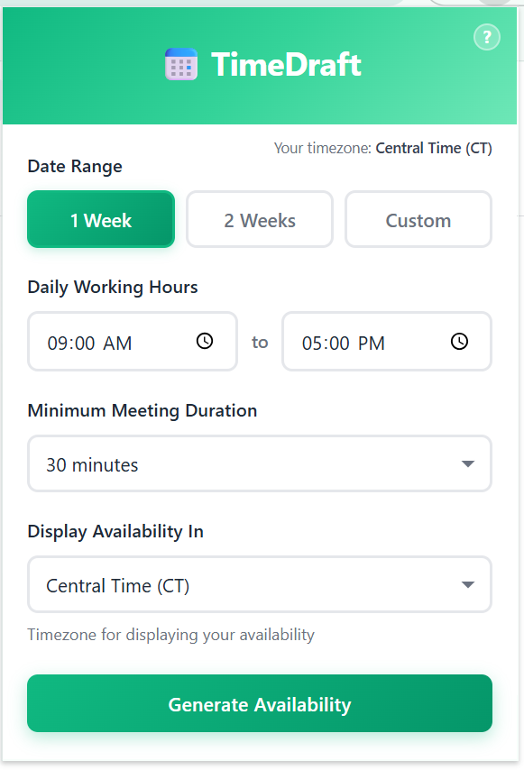
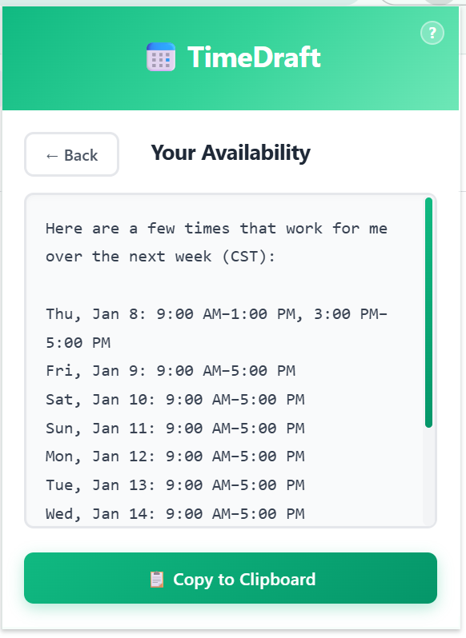
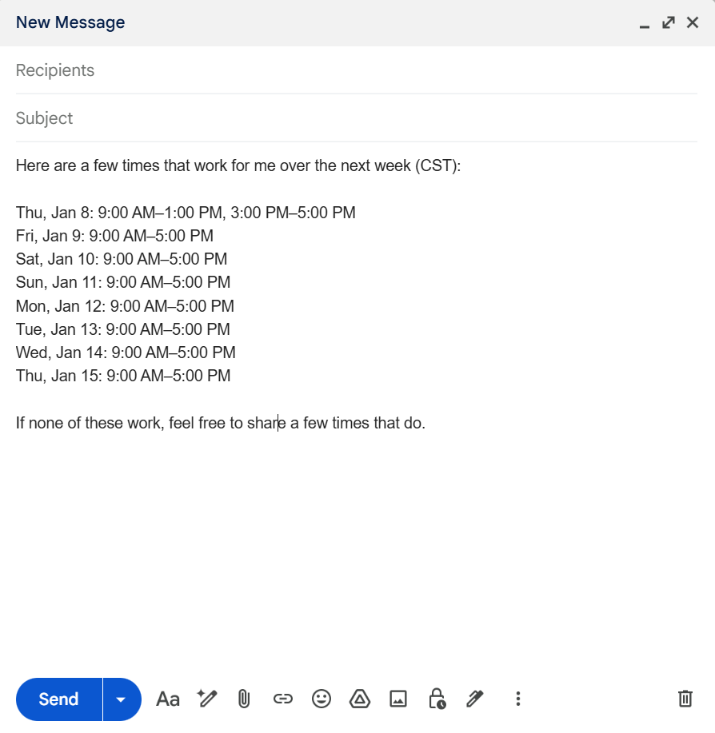
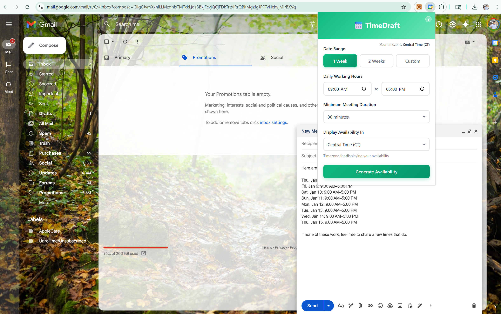

# TimeDraft 📅

**Never waste time coordinating meetings again.** TimeDraft is a Chrome extension that instantly generates your Google Calendar availability in a clean, shareable format—perfect for scheduling meetings via email.

**[Download TimeDraft from the Chrome Web Store](https://chromewebstore.google.com/detail/timedraft/efhedieleheodmmelckemgfjkjkgflep)**

## What It Does

TimeDraft pulls your free/busy times from Google Calendar and formats them into professional availability text that you can paste directly into your emails. Simply specify your preferences (date range, working hours, timezone), click Generate, and copy the results.

<p align="center">
  
  
  
</p>
<p align="center">
  
</p>

## Key Features

- **Smart Availability Detection** - Analyzes your Google Calendar to find free time slots
- **Timezone Conversion** - Display your availability in any timezone (ET, CT, MT, PT, etc.)
- **Customizable Preferences** - Set your working hours, minimum meeting duration, and date range
- **One-Click Copy** - Copy formatted availability text directly to your clipboard
- **Privacy-Focused** - Only accesses free/busy data, never reads event details
- **Secure OAuth** - Uses Google's official OAuth flow for calendar access

## How It Works

1. Click the TimeDraft extension icon in your browser
2. Configure your preferences:
   - **Date Range**: 1 week, 2 weeks, or custom dates
   - **Working Hours**: Your typical availability window (e.g., 9 AM - 5 PM)
   - **Minimum Duration**: Shortest meeting length to show (30, 45, 60, or 90 minutes)
   - **Display Timezone**: The timezone for presenting your availability
3. Click "Generate Availability"
4. Copy the formatted text and paste it into your email

The extension generates professional text like:

```
Here are a few times that work for me over the next week (ET):

Thu, Jan 8: 9:00 AM–1:00 PM, 3:00 PM–5:00 PM
Fri, Jan 9: 9:00 AM–5:00 PM
Sat, Jan 10: 9:00 AM–5:00 PM
Sun, Jan 11: 9:00 AM–5:00 PM
Mon, Jan 12: 9:00 AM–5:00 PM

If none of these work, feel free to share a few times that do.
```

## Technical Details

### Technologies Used

- **Chrome Extension Manifest V3** - Latest extension architecture
- **Google Calendar API** - FreeBusy endpoint for availability data
- **Luxon** - Industry-standard timezone handling and date manipulation
- **OAuth 2.0** - Secure authentication via Chrome Identity API
- **Vanilla JavaScript** - No frameworks, lightweight and fast

### Architecture

- **Popup Interface** (`src/popup/`) - User-facing form and results display
- **Background Service Worker** (`src/background/`) - OAuth handling, API calls, and availability computation
- **Core Algorithm** - Intelligent free time detection with timezone conversion
- **Text Formatter** - Generates human-readable availability text

### Privacy & Security

**Open source** - All code is publicly available for review  
**Minimal permissions** - Only requests calendar read access  
**No data storage** - Preferences are not saved; all processing happens locally  
**FreeBusy API only** - Never reads event titles, descriptions, or attendees  
**Secure OAuth** - Uses Google's official Chrome Identity API  

## Use Cases

- Scheduling 1:1 meetings with colleagues
- Finding time for client calls across timezones
- Coordinating team sync-ups
- Office hours scheduling
- Interview coordination

## Requirements

- Google Chrome (or Chromium-based browser)
- A Google account with Google Calendar

## Support & Feedback

Found a bug or have a feature request? [Open an issue on GitHub](https://github.com/AnishK05/timedraft-chrome-extension/issues)

## License

This project is open source and available for public review to ensure transparency and security.

---
