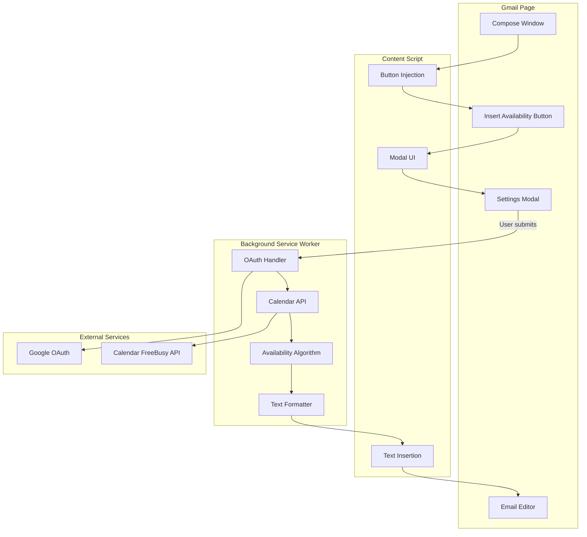

# Build TimeDraft Chrome Extension

## Overview

TimeDraft is a Chrome extension that adds an "Insert Availability" button to Gmail's compose toolbar. When clicked, it opens a modal where users can specify their preferences (date range, working hours, timezones), then fetches their Google Calendar free/busy data and inserts formatted availability slots into their email draft.

## Architecture




## File Structure

```javascript
timedraft-chrome-extension/
├── manifest.json
├── src/
│   ├── background/
│   │   ├── service_worker.js          # Main background entry
│   │   ├── google_auth.js             # OAuth token management
│   │   ├── calendar_api.js            # FreeBusy API calls
│   │   ├── availability.js            # Core algorithm
│   │   ├── time_utils.js              # Timezone helpers (Luxon)
│   │   └── format.js                  # Output formatting
│   ├── content/
│   │   ├── content_script.js          # Main content entry
│   │   ├── gmail_dom.js               # Gmail DOM helpers
│   │   ├── modal_ui.js                # Modal rendering
│   │   ├── modal_ui.css               # Modal styling
│   │   └── insert_text.js             # Text insertion logic
│   ├── shared/
│   │   └── constants.js               # Shared constants
│   └── lib/
│       └── luxon.min.js               # Bundled Luxon library
├── assets/
│   ├── icon16.png
│   ├── icon48.png
│   └── icon128.png
└── README.md
```


## Implementation Steps

### 1. Project Setup & Manifest Configuration

**Create [`manifest.json`](manifest.json)** with:

- `manifest_version: 3`
- Permissions: `identity`, `activeTab`
- Host permissions: `https://mail.google.com/*`, `https://www.googleapis.com/*`
- Content script matching `https://mail.google.com/*`
- Background service worker pointing to `src/background/service_worker.js`
- OAuth2 client ID (placeholder for now: `YOUR_CLIENT_ID_HERE.apps.googleusercontent.com`)

**Create [`src/shared/constants.js`](src/shared/constants.js)** with:

- Calendar API scopes (`calendar.freebusy` or `calendar.readonly`)
- Range presets (1 week, 2 weeks)
- Default values (working hours: 9am-5pm, min duration: 30min, weekdays only)
- Gmail DOM selectors (compose toolbar, editor div)

### 2. Content Script - Gmail Integration

**Create [`src/content/content_script.js`](src/content/content_script.js)**:

- Set up MutationObserver to detect Gmail compose windows
- For each new compose window, call inject button logic
- Handle modal open/close lifecycle
- Send messages to background worker when user submits
- Receive formatted text and trigger insertion

**Create [`src/content/gmail_dom.js`](src/content/gmail_dom.js)**:

- `findComposeWindows()`: Query all compose containers
- `getComposeToolbar(composeEl)`: Find toolbar div within compose
- `getComposeEditor(composeEl)`: Find contenteditable div
- `isButtonInjected(composeEl)`: Check if button already exists
- Use data attributes to track injection state per compose window

**Create [`src/content/modal_ui.js`](src/content/modal_ui.js)** and **[`modal_ui.css`](modal_ui.css)**:

- Render modal overlay with form fields:
- Range selector (1 week / 2 weeks / custom dates)
- Daily working hours (start/end time pickers)
- Minimum meeting duration (dropdown: 30/45/60/90 min)
- Days of week (checkboxes, default Mon-Fri)
- Source timezone (text input with validation)
- Output timezone (text input with validation)
- Buttons: "Generate & Insert" and "Cancel"
- Input validation before submission
- Callbacks: `onSubmit(payload)`, `onCancel()`

**Create [`src/content/insert_text.js`](src/content/insert_text.js)**:

- `insertTextIntoCompose(composeEl, text)`: 
- Focus the contenteditable div
- Use `document.execCommand('insertText', false, text)` for insertion
- Fallback to `execCommand('insertHTML')` with `<br/>` tags
- If both fail, copy to clipboard and show toast notification

### 3. Background Service Worker - Core Logic

**Create [`src/background/service_worker.js`](src/background/service_worker.js)**:

- Listen for `chrome.runtime.onMessage` from content script
- On `GET_AVAILABILITY` message:

1. Call `google_auth.js` to get access token
2. Parse user inputs and compute date range
3. Call `calendar_api.js` to fetch FreeBusy data
4. Call `availability.js` to compute free slots
5. Call `format.js` to generate email text
6. Send response back to content script with `formattedText`

- Handle errors gracefully with user-friendly messages

**Create [`src/background/google_auth.js`](src/background/google_auth.js)**:

- `getAccessToken(interactive = true)`:
- Use `chrome.identity.getAuthToken({ interactive, scopes })`
- Return token or throw error
- `removeToken(token)`: Clear invalid tokens
- Error handling for denied permissions

**Create [`src/background/calendar_api.js`](src/background/calendar_api.js)**:

- `fetchFreeBusy({ timeMin, timeMax, timeZone, token })`:
- POST to `https://www.googleapis.com/calendar/v3/freeBusy`
- Request body: `{ timeMin, timeMax, timeZone, items: [{ id: "primary" }] }`
- Parse response and extract busy intervals
- Return array of busy blocks: `[{ start: ISO8601, end: ISO8601 }, ...]`

**Create [`src/background/time_utils.js`](src/background/time_utils.js)**:

- Use Luxon for all date/time operations
- `parseDateRange(preset, customStart, customEnd, sourceZone)`: Convert to start/end dates
- `buildDailyWindows(startDate, endDate, dailyStart, dailyEnd, daysOfWeek, sourceZone)`: Generate daily working windows
- `convertToOutputZone(blocks, outputZone)`: Convert timestamps for display
- `formatTimeInZone(datetime, zone)`: Format for email output

### 4. Availability Algorithm

**Create [`src/background/availability.js`](src/background/availability.js)**:Core algorithm to compute free time slots:

1. **For each day in range**:

- Skip if day-of-week not enabled
- Create working window in source timezone (e.g., 9am-5pm)

2. **Filter and merge busy intervals**:

- Convert Calendar API busy times to source timezone
- Find overlaps with daily working window
- Sort by start time
- Merge overlapping/adjacent busy blocks

3. **Compute free blocks**:

- Start cursor at window start
- For each busy block: add free slot from cursor to busy.start (if gap exists)
- Move cursor to busy.end
- After all busy blocks: add final free slot from cursor to window end

4. **Filter by minimum duration**:

- Remove blocks shorter than user-specified minimum

5. **Return structure**:
   ```javascript
      {
        "2026-01-12": [
          { start: "2026-01-12T14:00:00Z", end: "2026-01-12T17:00:00Z" },
          ...
        ],
        ...
      }
   ```


### 5. Text Formatting

**Create [`src/background/format.js`](src/background/format.js)**:

- Convert free blocks to output timezone
- Group by date
- Format each day's slots with friendly date/time labels
- Example output:
  ```javascript
    Here are a few times that work for me over the next 2 weeks (ET):
    
    Mon, Jan 12: 10:00 AM–12:30 PM, 2:00 PM–5:00 PM
    Tue, Jan 13: 9:00 AM–11:00 AM
    Thu, Jan 15: 1:00 PM–4:00 PM
    
    If none of these work, feel free to share a few times that do.
  ```

- Handle edge case: no free time → insert polite "I'm fairly booked" message
- Limit to top 2-3 blocks per day for readability

### 6. Dependencies & Assets

**Download and bundle Luxon**:

- Download `luxon.min.js` from CDN
- Save to [`src/lib/luxon.min.js`](src/lib/luxon.min.js)
- Import in background service worker

**Create extension icons**:

- Generate or create 16x16, 48x48, 128x128 PNG icons
- Save to [`assets/`](assets/) directory
- Reference in manifest.json

### 7. Error Handling & Edge Cases

Implement throughout:

- **OAuth denied**: Show message "Calendar access required to fetch availability"
- **Token expired**: Auto-retry with token refresh
- **API failure**: Show error + copy-to-clipboard fallback
- **No free slots**: Insert friendly "I'm booked" message
- **Multiple compose windows**: Track each separately with data attributes
- **Invalid timezones**: Validate against IANA timezone list
- **Daylight saving transitions**: Luxon handles automatically

### 8. Documentation

**Create [`README.md`](README.md)** with:

- Project overview and features
- Installation instructions (load unpacked extension)
- Google Cloud OAuth setup guide:
- Create project
- Enable Calendar API
- Create OAuth client for Chrome Extension
- Copy Client ID to manifest.json
- Usage instructions
- Development setup
- Testing checklist

## Key Technical Decisions

1. **No persistent storage**: Users enter preferences each time (v1 requirement)
2. **FreeBusy API only**: Don't access event details, just busy/free times
3. **Luxon for timezones**: Reliable, well-tested library for timezone handling
4. **Content script for UI**: Gmail DOM manipulation stays in content context
5. **Background for logic**: OAuth and computation in service worker
6. **Custom CSS**: Lightweight, Gmail-matching aesthetic

## Testing Checklist

- [ ] Button appears in new compose window
- [ ] Button appears in reply/forward compose
- [ ] Multiple compose windows work independently
- [ ] Modal opens and closes correctly
- [ ] OAuth flow triggers on first use
- [ ] Calendar data fetched successfully
- [ ] Free slots computed correctly
- [ ] Timezone conversion works (test different source/output TZs)
- [ ] Text inserts at cursor position
- [ ] Formatted text matches expected style
- [ ] Error handling works (deny OAuth, API failure)
- [ ] Edge cases: all-day events, DST boundaries, no free time

## OAuth Setup (Post-Implementation)

After code is complete, you'll need to:

1. Go to Google Cloud Console
2. Create new project "TimeDraft"
3. Enable "Google Calendar API"
4. Create OAuth 2.0 Client ID for "Chrome Extension"
5. Copy Client ID to manifest.json